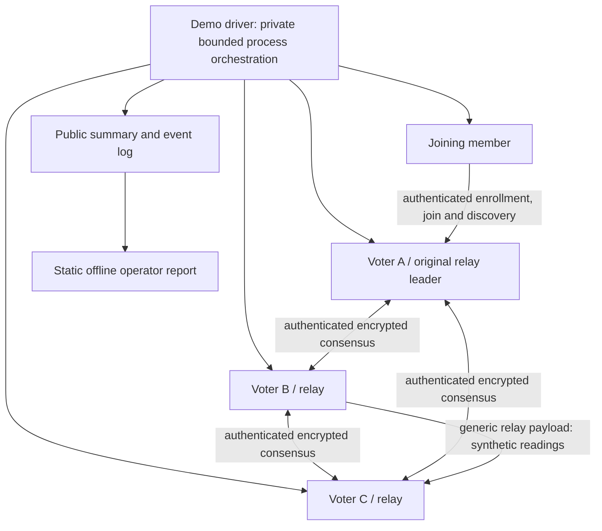
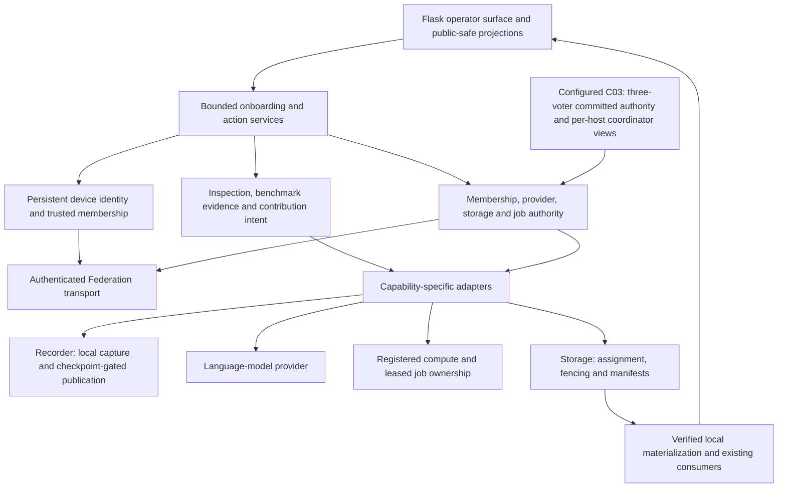
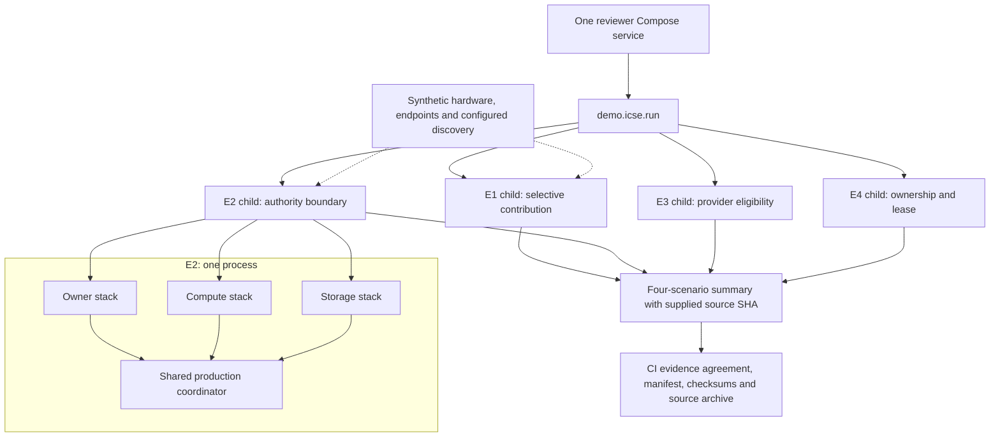

# Architecture figure source

These Mermaid diagrams are explanatory source for the paper/demo. They are not
screenshots or validation results. Render and visually review the final figures
against the exact released source before publication. Final release SHA/tag:
**PENDING** until the release process succeeds.

## Primary network demonstration

The main story uses four independent local processes: three voter/relay nodes
and one joining member. The script invokes production runtime/relay/client APIs;
TCP/WebSocket messages cross actual process boundaries. See `network/README.md`
for exact implementation and limitations. Execution validation remains pending
until the corresponding exact-release evidence exists.

Caption: “Independent local members exchange a synthetic payload through the
production membership-authorized relay. After an actual leader process is
terminated, the survivors elect and clients explicitly reconnect to repeat the
interaction. The driver records observations; it does not implement consensus.”
The B-to-C arrow denotes logical relay delivery, not a direct peer transport.
Capability declarations are illustrative; no executable provider, Recorder,
storage, compute job or Flask UI is started. One-machine process loss is not
physical-host failure.

## Product boundaries

The standalone [Federation overview figure](figures/federation-v1-overview.svg)
is explanatory architecture, not an execution observation. It is included in
both source and artifact metadata with checksums.

Suggested caption: “FCP separates device membership, contribution intent,
capability-specific authority and execution. A device can combine several
contributions. Configured C03 deployments derive authority from a fixed
three-voter command log and materialize local coordinator views.”

The optional C03 mode uses authenticated encrypted peer transport and a separate
private committed credential-snapshot path. Transient connections and browser
sessions are not replicated. With no `FCP_REPLICATED_CONTROL_PLANE_CONFIG`, the
relay wrapper delegates to the established coordinator service. Name the mode
actually evaluated. Control-plane, storage and job authority have distinct
failure/recovery contracts.

Source anchors: `catalog/federation/control_plane_product.py`,
`catalog/federation/control_plane_runtime.py`,
`catalog/relay/replicated_provider_service.py`, and `docs/architecture.md`.

## Supporting E1–E4 component composition

Suggested caption: “The portable artifact exercises production components in
four child-process scenarios. E2's three logical member stacks share a
coordinator; synthetic adapters stand in for external observations. This is not
a networked three-host deployment or a physical failover experiment.”

Source anchors: `demo/icse/run.py`, `harness.py`, `scenarios.py`,
`runtime_eligibility.py`, `ownership_boundary.py`, and `bundle.py`. The current
artifact demonstrates no live browser, actual compute result or Recorder data.
Keep physical topology and eventual acceptance results in a separately labeled
evaluation figure/table, with exact source and evidence identifiers.
