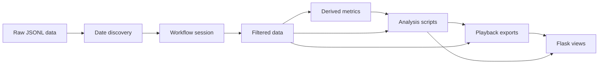

# Architecture

MSH is a Flask-first orchestration and analysis system for CNC telemetry. It keeps the web UI responsive while background runtime work prepares data, runs scripts, and exposes artifacts for inspection.

## Dataflow

## Components

### Flask application

`catalog/flask_app/` contains the primary UI. It registers routes for overview, control, status, playback, analyses, exploration, live telemetry, and startup choices. UI services cache short-lived snapshots so frequently refreshed pages do not repeatedly scan all sessions or artifacts.

### Orchestrator

`catalog/orchestrator/` owns runtime policy: webapp-first startup, latest-day bootstrap, best-effort script execution, historical catch-up, polling for new data, runtime state persistence, and startup mode decisions.

The orchestrator deliberately reuses `catalog/runner/` helpers instead of replacing all runner internals. This keeps behavior aligned between automatic runtime work and manual `/control` actions.

### Runner/session layer

`catalog/runner/` handles script discovery, hidden-folder filtering, workflow metadata, date filtering, isolated run workspaces, subprocess execution, and playback export preparation.

Scripts run in copied workspaces with session data linked or copied into `data/`. Subprocess stdin is disabled so Docker and Flask-triggered runs do not block waiting for terminal input.

### Common telemetry utilities

`catalog/common/` contains reusable loading, timestamp/machine normalization, basic metrics, state inference, event grouping, and timeline export utilities. New scripts should prefer these helpers so data assumptions remain consistent.

### Script catalog

Each `catalog/<script>/` directory contains a runnable analysis script and usually a script-specific README. The top-level [catalog/README.md](../catalog/README.md) is the canonical script catalog and workflow stage reference.

## Runtime policies

- **Startup handoff:** Flask starts before background data preparation completes.
- **Bootstrap date policy:** process the latest discovered source day first.
- **Execution policy:** best effort; continue after individual script failures and surface failure state.
- **Catch-up policy:** process historical days incrementally instead of forcing a full rebuild on startup.
- **Playback coverage:** automatic scripts are bounded to health checks plus timeline/playback generation; manual and deep/exploratory scripts are excluded from bootstrap/catch-up.
- **Cache policy:** reuse session data, script outputs, and playback exports when metadata signatures and expected files indicate they are still valid.

## Startup mode decisions

When the runtime namespace already has state, the app can require a startup choice before background processing begins. Continuing preserves existing workflow/runtime artifacts. Starting clean resets the namespace-scoped runtime path. This decision is exposed at `/startup` rather than through the deprecated terminal menu.

## Artifacts and scan roots

The artifact catalog scans configured roots such as `results` and `data`. Artifacts can be generated by automatic scripts, manual scripts, playback export helpers, or external preparation. See the [Operator guide](operator_guide.md#core-concepts) for terminology.

## Design limitations

- The control panel is single-process and threaded; it is not a distributed job queue.
- Recent control history is in memory and not durable across restarts.
- Cache invalidation is intentionally lightweight and file/metadata based.
- Manual and deep/exploratory analysis scripts may be slow and are excluded from bootstrap/catch-up.
- Legacy and ingestion tools remain in the repository but are not runner-visible workflow steps.
