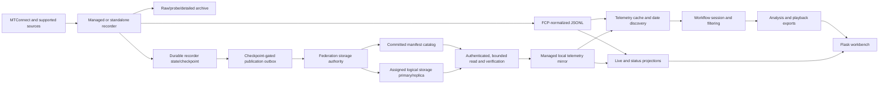

# FCP architecture

Status: **current architecture reference**

Reviewed: **2026-08-11 Europe/Oslo**

FCP is a Flask-first CNC telemetry workbench with a trusted multi-device Federation layer. Local telemetry, operator workflows, and analysis remain usable without remote providers. Federation adds authenticated device identity, membership, capability contribution, storage authority, jobs, transport, recovery, bounded software-update intent, and bounded standalone-recorder control without turning the Flask request process into a general host administrator.

## Product model

One installation is one persistent FCP device.

A device may combine:

- Flask workbench and documentation;
- MTConnect recording and source access;
- language-model service;
- explicitly registered compute handlers;
- storage capacity as a candidate or assigned provider;
- authenticated relay or transport assistance;
- future versioned capabilities.

A device is not assigned one permanent product role. Internal authority states such as storage primary, replica, job owner, session creator, member, provider, lease holder, or artifact grantee remain explicit backend state.

The former role-first product runtime has been retired from normal installed-product authority. Retained legacy state/readers exist only for explicit migration and compatibility boundaries.

## Required first-run composition

```text
Identity
  -> Federation
  -> Inspect
  -> finish setup
  -> open Federation
```

A current inspection is enough to complete setup. Benchmarks and contribution decisions are optional later actions.

## Major boundaries

```text
Flask product surface
  -> composition and public-safe projections
  -> reviewed bounded action services
  -> existing domain services and authorities
  -> durable local or Federation state

Device/node client
  -> persistent cryptographic identity
  -> authenticated relay/control-plane connection
  -> replay and reconnect state
  -> logical capability routes

Federation coordinator/control plane
  -> membership and revocation
  -> ordered events and revisions
  -> provider and job authority
  -> storage assignments, terms, leases, and fencing
  -> coordinator-owned bounded update intent

Capability providers
  -> recorder
  -> language model
  -> registered compute handlers
  -> storage providers

Host-owned agents/processes
  -> bounded FCP runtime activation
  -> standalone recorder capture/control execution
```

Flask presents product state and invokes reviewed service boundaries. It does not become the distributed coordinator, storage leader, provider authority, job authority, Git/Docker authority, or arbitrary remote-command server.

## Identity, Federation, and membership

`catalog/node/` owns persistent device identity and outbound Federation client behavior. `catalog/federation/` owns domain contracts and control-plane services. `catalog/relay/` provides the authenticated relay service.

The product uses `federation_id` in the UI while retaining `session_id` as the internal protocol, isolation, persistence, replay, membership, job, provider, storage, artifact, update-event, and recorder-control boundary.

Discovery identifies candidates. Trust and membership require an existing trusted binding, explicit authorized acceptance, or signed expiring pairing material. Public device IDs and network presence never grant authority.

Browser-generated `FCP1-...` pairing codes are signed, one-use, and valid for up to 10 minutes. After successful enrollment, a joining device persists its stable identity and public-safe reconnect binding rather than persisting the pairing code or enrollment/invitation tokens.

## Transport

The supported transport model includes:

- outbound authenticated node connections;
- relay-first connectivity;
- direct encrypted peer streams where available;
- relay fallback;
- signed route and rendezvous information;
- bounded verified resumable object transfer;
- reconnect and replay after interruption;
- bounded application messages for recorder publication/control; and
- ordered session events for declarative update/control intent.

Correctness cannot depend on direct peer connectivity. Private internal service ports must not be exposed publicly merely to simplify transport.

## Device inspection and benchmarks

Inspection discovers bounded supported local facts such as configured data sources, model availability, registered handlers, storage candidates, hardware, and network seams.

Benchmarks are versioned evidence with explicit run, skip, cancel, invalidation, and rerun behavior. They describe suitability or capacity only. They cannot create membership, activate a provider, assign storage, dispatch a job, grant artifact access, or authorize a software update.

The installed product reuses saved evidence across ordinary starts/updates unless an operator explicitly reruns it or a structural dependency/version identity changes. Elapsed wall-clock time alone does not grant or revoke authority.

## Contribution lifecycle

Contribution intent is distinct from inspection, benchmark evidence, Federation policy, provider health, activation, selection, and authority.

Supported contribution behavior includes:

- independent candidates for recorder, AI, registered compute, and storage;
- enable, disable, suspend, and reconcile operations;
- coexistence of several capabilities on one device;
- authenticated health/capacity evidence;
- no unrelated authority from enabling one capability; and
- no membership deletion when one contribution is disabled.

## Storage authority

Application components use logical storage contracts rather than connecting directly to arbitrary physical databases.

Storage authority includes:

- coordinator-assigned writable primary and zero or more replicas;
- terms, leases, fencing tokens, and stale-write rejection;
- immutable idempotent batches and object identities;
- durable local outbox and acknowledgement policy;
- authoritative manifests, hashes, watermarks, and missing ranges;
- completeness-aware promotion;
- explicit degraded state when no qualified complete candidate exists; and
- restart, catch-up, reinstatement, and returning-former-primary behavior without self-promotion.

A benchmark creates a storage candidate only. It cannot assign primary or replica authority.

## AI, compute, jobs, and artifacts

Language-model and compute providers use capability-specific scheduling rather than storage primary/replica semantics.

The current boundaries include:

- authenticated provider enrollment and health;
- logical provider selection;
- remote AI invocation through authorized routes;
- compute limited to explicitly registered local handlers;
- versioned jobs and attempts;
- durable job ownership;
- duplicate suppression, timeout, retry, cancellation, and reassignment;
- stale-worker fencing;
- one logical committed result; and
- least-privilege job-scoped artifact authorization and verified publication.

FCP does not transfer arbitrary executable code to compute providers.

## Recorder and telemetry data flow


```mermaid
flowchart LR
    S[MTConnect and supported sources] --> R[Managed or standalone recorder]
    R --> RAW[Raw/probe/detailed archive]
    R --> J[FCP-normalized JSONL]
    R --> W[Durable recorder state/checkpoint]
    J --> C[Telemetry cache and date discovery]
    C --> F[Workflow session and filtering]
    F --> A[Analysis and playback exports]
    J --> L[Live and status projections]
    A --> U[Flask workbench]
    L --> U
    W --> O[Checkpoint-gated publication outbox]
    O --> SA[Federation storage authority]
    SA --> P[Assigned logical storage primary/replica]
    SA --> MC[Committed manifest catalog]
    MC --> VR[Authenticated, bounded read and verification]
    P --> VR
    VR --> M[Managed local telemetry mirror]
    M --> C
    M --> L
```

JSONL remains the local compatibility source. Recorder durability preserves raw/derived write ordering and checkpoints. Federation delivery is layered onto the local-first path; it must not make local recording depend on continuous remote availability.

Federation members discover recorder batches only through the coordinator-owned
committed manifest. Provider directories, prepared batches, remote paths, and
uncommitted data are never catalogued. Every read is bound to its manifest
revision and is checked for session membership, dataset identity, canonical
size, content hash, and the allowlisted recorder schema before it enters a
quota-limited, content-addressed local mirror. Only the mirror's rebuilt
telemetry JSONL directory is visible to the Flask artifact catalog.

This path is intentionally not general file sharing. Arbitrary uploads and
other peer files require a separately authorized object grant, object catalog,
type policy, and materializer before they can be exposed to another device.

A standalone recorder may join the Federation without hosting Flask. On first configuration, `start_recorder.py` can run the existing bounded private-network scan, select discovered sources, join using the signed pairing flow, start recording, and start independent publication/control workers.

## Standalone recorder control

Recorder control is an explicit bounded Federation protocol, not generic remote administration.

```text
trusted Federation member
  -> authenticated recorder-control session event
  -> target standalone recorder worker
  -> local request validation
  -> bounded recorder-local scan or source-selection mutation
  -> public-safe report event
```

The requesting device can choose the target recorder and request a scan/source change, but:

- the scan executes on the recorder host;
- the network remains constrained to validated RFC1918 IPv4 `/24` or smaller;
- additions refer only to opaque source IDs from that recorder's latest scan;
- arbitrary source URLs, credentials, shell text, and unrestricted network ranges are not accepted; and
- removals change future capture without deleting historical data/checkpoints.

The control worker durably tracks/report retries so a reporting failure does not require repeating a successfully applied source mutation or scan unnecessarily.

## Federation-wide runtime updates

Software updates are also declarative and bounded.

```text
Federation coordinator/session creator
  -> exact approved main commit intent
  -> authenticated session event
  -> target Flask update-event processor
  -> local bounded JSON handoff
  -> host-owned update agent
  -> fast-forward/build/restart/runtime proof
  -> authenticated result event
```

The browser does not supply a repository, branch, path, executable, command, or arbitrary arguments. Each normal FCP host independently validates the exact commit, approved source repository `main`, clean working tree, trusted remote, ancestry, and fast-forward relationship.

The host-owned update agent rebuilds the Compose-managed `relay`, `flask`, and `recorder` images, preserves saved state, resumes the installation, and reports success only after the running image proves the exact target commit and required services are running.

The internal terminal state is `runtime_verified`; the UI presents it as **Updated**.

A standalone recorder launched directly with `python start_recorder.py` does not host this Flask/host-agent activation pipeline and therefore requires its own host process/update administration until a dedicated standalone update path is implemented.

## Flask application

`catalog/flask_app/` is the supported operator surface. It composes:

- capability-first onboarding;
- Federation overview and detail projections;
- explicit pairing/update/recorder-control action surfaces;
- local monitor, status, live, playback, source, and control views;
- knowledge capture and compatibility export;
- documentation browser;
- AI explanation and connected-provider behavior; and
- deterministic migration readers only where an upgraded installation still requires them.

Federation pages use public-safe projections. They must not expose private endpoints, credentials, enrollment material, private keys, database paths, recorder source URLs, or unrestricted local configuration.

## Local orchestration and analysis

`catalog/orchestrator/` manages local runtime policy and background preparation. `catalog/runner/` owns workflow sessions, filtering, script discovery, execution, and playback export. `catalog/common/` provides shared telemetry normalization, source state, cache, metrics, and timeline utilities.

These local workflow responsibilities remain separate from Federation membership, provider, job, storage, transport, update, and recorder-control authority.

## Persistence

Important durable state includes:

- device identity and trusted Federation binding;
- coordinator membership and ordered events;
- onboarding, inspection, benchmark, and contribution intent state;
- capability/source configuration and recorder checkpoints;
- standalone-recorder initial-selection/control/publication state;
- host-update handoff/result state;
- storage assignments, manifests, outboxes, terms, leases, and recovery records;
- provider, job, attempt, artifact, and reconciliation state;
- local telemetry and generated workflow results.

Normal startup preserves state. A documented fresh reset must name exactly what is removed and what is retained.

## Acceptance boundary

Automated tests prove contracts and bounded product composition. They do not prove real MTConnect, Ollama/accelerator, multi-host network, target storage, or real-browser behavior.

Complete Federation v1 acceptance remains false until the required physical evidence validates against one exact candidate commit. The machine-readable source is `catalog/federation/tests/cf7_acceptance/scenarios.json`.

## Related references

- [Federation operations](federation_operations.md)
- [Standalone recorder](standalone_recorder.md)
- [Federated network reference](federated_session_network.md)
- [Capability-first Federation plan](implementation/federation/active/capability_first_federation_plan.md)
- [Detailed update design](implementation/federation/active/manual_updates.md)
- [Federation v1 scope](releases/federation_v1_scope.md)
- [Data contract](data_contract.md)
- [Workflow sessions](workflow_sessions.md)
- [Operator guide](operator_guide.md)
