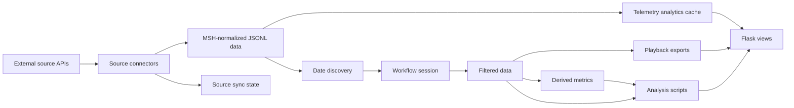

# Architecture

MSH is a Flask-first orchestration and analysis system for CNC telemetry. It keeps the web UI responsive while background runtime work prepares data, runs scripts, and exposes artifacts for inspection.

## Phase 1 local federation boundary

Federation's first implementation is local-only. Backend-neutral synchronous
storage and capability-provider contracts sit in `catalog/federation`, with a
process-local, thread-safe capability registry and a durable SQLite outbox. The
registry is explicitly not durable and the outbox does not claim or deliver
network work.

Recorder storage remains owned by `DurableRecorderStore`. Its adapter delegates
the existing raw, detailed-observation, compatibility JSONL write sequence
without changing paths or checkpoint behavior. Filesystem files and SQLite do
**not** share an ACID transaction. A transactional SQLite prepared record first
persists the immutable session, destination, schema, idempotency identity, and
content hash. The recorder then writes its existing raw manifest and derived
files before that prepared record becomes pending. After interruption, recorder
recovery completes derived files and reconciliation activates only matching
prepared records using their original persisted routing. Incomplete prepares
are never advertised. Completed rows are retained rather than deleted,
preserving acknowledgement and idempotency history.

## Phase 2 opt-in relay-first session network

Phase 2 adds an independently runnable WebSocket relay and outbound-only node
agent without changing the local Flask, recorder, workbench, JSONL, or
AI-provider workflows. `catalog/relay/` owns the authenticated network
boundary, `catalog/node/` owns persistent Ed25519 identity and durable replay
state, and the transactional coordinator and authoritative session event log
remain in `catalog/federation/`.

The relay's SQLite control database durably owns enrollment, revocation,
sessions, membership, invitation hashes, capability announcements,
connectivity, audit records, request deduplication, and per-session ordered
events. This event history is separate from the Phase 1 delivery outbox. Flask
does not hold distributed coordinator authority, and node agents bind no
inbound service port.

Transport envelopes use protocol major version 1 over bounded WebSocket
frames. Authenticated membership checks and replay snapshots share SQLite
transactions; event delivery is contiguous per connection, paged, and ordered
only by coordinator revision. Command and event idempotency keys are retained
as digests, while raw enrollment and invitation tokens are returned once and
never stored. Public status is cursor-paged and excludes credential-shaped
values, backend paths, and physical storage addresses.

The feature is disabled unless the relay profile or standalone relay process is
started. See the
[Phase 2 relay-first session runbook](implementation/federated_session_phase2_runbook.md)
for secure defaults and a two-node exercise.

## Dataflow

```mermaid
flowchart LR
    S[External source APIs] --> T[Source connectors]
    T --> A[MSH-normalized JSONL data]
    T --> U[Source sync state]
    A --> B[Date discovery]
    B --> C[Workflow session]
    C --> D[Filtered data]
    D --> E[Derived metrics]
    E --> F[Analysis scripts]
    D --> F
    D --> G[Playback exports]
    A --> I[Telemetry analytics cache]
    I --> H[Flask views]
    G --> H
    F --> H
```

The source connector layer is optional for historical/local JSONL workflows. It becomes important when data comes from external systems such as Observer Phoenix. Connectors must write MSH-compatible JSONL before shared workflow, cache, and playback code consumes the data.

## Components

### Flask application

`catalog/flask_app/` contains the primary UI. It registers routes for overview, control, status, playback, analyses, exploration, live telemetry, and startup choices. UI services cache short-lived snapshots so frequently refreshed pages do not repeatedly scan all sessions or artifacts.

### Orchestrator

`catalog/orchestrator/` owns runtime policy: webapp-first startup, latest-day bootstrap, best-effort script execution, historical catch-up, polling for new data, runtime state persistence, and startup mode decisions.

The orchestrator deliberately reuses `catalog/runner/` helpers instead of replacing all runner internals. This keeps behavior aligned between automatic runtime work and manual `/control` actions.

### Runner/session layer

`catalog/runner/` handles script discovery, hidden-folder filtering, workflow metadata, date filtering, isolated run workspaces, subprocess execution, and playback export preparation.

Scripts run in copied workspaces with session data linked or copied into `data/`. Environment variables such as `MSH_SESSION_ID`, `MSH_SESSION_DIR`, and `MSH_RUN_DIR` identify the active workflow session and run directory.

### Source connectors

`catalog/observer_phoenix/` is the first source connector package. It authenticates against Observer Phoenix, discovers machines and points, fetches trend measurements, and writes normalized JSONL under `data/sources/observer_phoenix/jsonl/`.

Source connectors should remain outside runner-visible script discovery. They prepare input data; they are not one-shot analysis scripts. Their persistent synchronization state belongs under `data/source_state/` and should not use a `.jsonl` extension.

### Common telemetry utilities

`catalog/common/` contains reusable loading, timestamp/machine normalization, basic metrics, state inference, event grouping, and timeline export utilities. New scripts should prefer these helpers so data assumptions remain consistent.

`catalog/common/source_sync.py` contains small source-state helpers for external-source watermarks and metadata. It is intentionally generic and does not know any vendor API schema.

`catalog/common/telemetry_cache.py` builds a disposable Parquet cache over raw JSONL and exposes DuckDB query helpers for production read paths such as live/latest telemetry, playback machine/day loading, exploration filtering, and machine/day summaries. JSONL remains the source of truth: rebuilding the cache still scans and loads the raw JSONL corpus before writing Parquet, so the current cache primarily accelerates repeated reads after a fresh cache exists rather than making ingestion incremental.

### Script catalog

Each `catalog/<script>/` directory contains a runnable analysis script and usually a script-specific README. The top-level [catalog/README.md](../catalog/README.md) is the canonical script catalog and workflow stage reference.

## Runtime policies

- **Startup handoff:** Flask starts before background data preparation completes.
- **Bootstrap date policy:** process the latest discovered source day first.
- **Execution policy:** best effort; continue after individual script failures and surface failure state.
- **Catch-up policy:** process historical days incrementally instead of forcing a full rebuild on startup.
- **Playback coverage:** automatic scripts are bounded to health checks plus timeline/playback generation; manual and deep/exploratory scripts are excluded from bootstrap/catch-up.
- **Cache policy:** reuse session data, script outputs, playback exports, and the telemetry analytics cache when metadata signatures and expected files indicate they are still valid. The telemetry analytics cache is a cached read path for cache-covered fields; cache rebuilds are still full JSONL-to-Parquet rebuilds, and derived session-specific outputs continue using session artifacts.
- **Source synchronization policy:** external sources should synchronize into MSH-normalized JSONL first, update source watermarks only after successful writes, and rely on the existing cache/session pipeline after synchronization.

## Startup mode decisions

When the runtime namespace already has state, the app can require a startup choice before background processing begins. Continuing preserves existing workflow/runtime artifacts. Starting clean resets the namespace-scoped runtime path. This decision is exposed at `/startup` rather than through the deprecated terminal menu.

## Artifacts and scan roots

The artifact catalog scans configured roots such as `results` and `data`. Artifacts can be generated by automatic scripts, manual scripts, playback export helpers, source synchronization steps, or external preparation. See the [Operator guide](operator_guide.md#core-concepts) for terminology.

## Federated session network plan

The default workbench architecture remains local. The opt-in Phase 2
implementation now allows authenticated nodes on different physical networks
to join a shared, versioned session through the relay-first control plane and
advertise multiple capabilities. Later phases in the proposal define the
user-contributed data plane, completeness-aware storage leadership, replicas,
leases, terms, fencing tokens, direct peer transport, and distributed
scheduling; none of those later-phase features are operational in Phase 2.

See [Federated MSH Session Network](federated_session_network.md) for the full proposal, failure model, protocol boundaries, security requirements, and phased implementation plan.

## Design limitations

- The control panel is single-process and threaded; it is not a distributed job queue.
- Recent control history is in memory and not durable across restarts.
- Cache invalidation is intentionally lightweight and file/metadata based.
- Telemetry analytics cache rebuilds are full rebuilds that load JSONL before writing Parquet; incremental updates are future work.
- Telemetry cache status checks are cached briefly in request paths; forced status scans still recursively inspect source/cache files.
- Telemetry cache queries currently open short-lived in-memory DuckDB connections; a persistent connection/cache manager is future work if refresh frequency requires it.
- Live/latest telemetry cache reads currently use a window query over cached rows; a rolling latest-row cache or partition-pruned latest-query strategy is future work for multi-month datasets.
- Source synchronization is currently a batch step, not a distributed ingestion service or message queue.
- Manual and deep/exploratory analysis scripts may be slow and are excluded from bootstrap/catch-up.
- Legacy and ingestion tools remain in the repository but are not runner-visible workflow steps.
