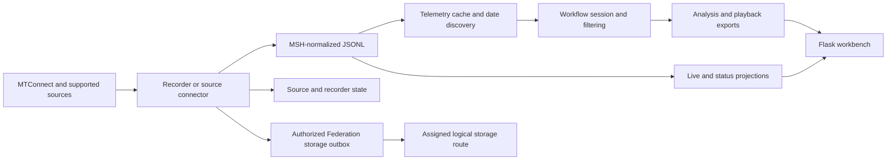

# MSH architecture

Status: **current architecture reference**  
Reviewed: **2026-08-07 Europe/Oslo**

MSH is a Flask-first CNC telemetry workbench with a trusted multi-device Federation layer. Local telemetry, operator workflows, and analysis remain usable without remote providers. Federation adds authenticated device identity, membership, capability contribution, storage authority, jobs, transport, and recovery without moving those authorities into the Flask request process.

## Product model

One installation is one persistent MSH device.

A device may combine:

- Flask workbench and documentation;
- MTConnect recording and source access;
- language-model service;
- explicitly registered compute handlers;
- storage capacity as a candidate or assigned provider;
- authenticated relay or transport assistance;
- future versioned capabilities.

A device is not assigned one permanent product role. Internal authority roles such as storage primary, replica, job owner, administrator, member, provider, lease holder, or artifact grantee remain explicit backend states.

## Required first-run composition

```text
Identity
  -> Federation
  -> Inspect
  -> finish setup
  -> open Federation
```

A current inspection is enough to complete setup. Benchmarks and contribution decisions are optional later actions.

## Major boundaries

```text
Flask product surface
  -> composition and public-safe projections
  -> existing domain services and authorities
  -> durable local or Federation state

Device/node agent
  -> persistent cryptographic identity
  -> authenticated relay/control-plane connection
  -> replay and reconnect state
  -> logical capability routes

Federation coordinator/control plane
  -> membership and revocation
  -> ordered events and revisions
  -> provider and job authority
  -> storage assignments, terms, leases, and fencing

Capability providers
  -> recorder
  -> language model
  -> registered compute handlers
  -> storage providers
```

Flask presents product state and invokes reviewed service boundaries. It does not become the distributed coordinator, storage leader, provider authority, or job authority.

## Identity, Federation, and membership

`catalog/node/` owns persistent device identity and outbound Federation client behavior. `catalog/federation/` owns domain contracts and control-plane services. `catalog/relay/` provides the authenticated relay service.

The current compatible product uses `federation_id` in the UI while retaining `session_id` as the internal protocol, isolation, persistence, replay, membership, job, provider, storage, and artifact boundary.

Discovery identifies candidates. Trust and membership require an existing trusted binding, explicit authorized acceptance, or signed expiring pairing material. Public device IDs and network presence never grant authority.

## Transport

The supported transport model includes:

- outbound authenticated node connections;
- relay-first connectivity;
- direct encrypted peer streams where available;
- relay fallback;
- signed route and rendezvous information;
- bounded verified resumable object transfer;
- reconnect and replay after interruption.

Correctness cannot depend on direct peer connectivity. Private internal service ports must not be exposed publicly merely to simplify transport.

## Device inspection and benchmarks

Inspection discovers bounded supported local facts such as configured data sources, model availability, registered handlers, storage candidates, hardware, and network seams.

Benchmarks are versioned evidence with explicit run, skip, cancel, expiry, invalidation, and rerun behavior. They describe suitability or capacity only. They cannot create membership, activate a provider, assign storage, dispatch a job, or grant artifact access.

## Contribution lifecycle

Contribution intent is distinct from inspection, benchmark evidence, Federation policy, provider health, activation, selection, and authority.

Supported contribution behavior includes:

- independent candidates for recorder, AI, registered compute, and storage;
- enable, disable, suspend, and reconcile operations;
- coexistence of several capabilities on one device;
- authenticated expiring health and capacity;
- no unrelated authority from enabling one capability;
- no membership deletion when one contribution is disabled.

## Storage authority

Application components use logical storage contracts rather than connecting directly to arbitrary physical databases.

Storage authority includes:

- coordinator-assigned writable primary and zero or more replicas;
- terms, leases, fencing tokens, and stale-write rejection;
- immutable idempotent batches and object identities;
- durable local outbox and acknowledgement policy;
- authoritative manifests, hashes, watermarks, and missing ranges;
- completeness-aware promotion;
- explicit degraded state when no qualified complete candidate exists;
- restart, catch-up, reinstatement, and returning-former-primary behavior without self-promotion.

A benchmark creates a storage candidate only. It cannot assign primary or replica authority.

## AI, compute, jobs, and artifacts

Language-model and compute providers use capability-specific scheduling rather than storage primary/replica semantics.

The current boundaries include:

- authenticated provider enrollment and health;
- logical provider selection;
- remote AI invocation through authorized routes;
- compute limited to explicitly registered local handlers;
- versioned jobs and attempts;
- durable job ownership;
- duplicate suppression, timeout, retry, cancellation, and reassignment;
- stale-worker fencing;
- one logical committed result;
- least-privilege job-scoped artifact authorization and verified publication.

MSH does not transfer arbitrary executable code to compute providers.

## Recorder and telemetry data flow


```mermaid
flowchart LR
    S[MTConnect and supported sources] --> R[Recorder or source connector]
    R --> J[MSH-normalized JSONL]
    R --> W[Source and recorder state]
    J --> C[Telemetry cache and date discovery]
    C --> F[Workflow session and filtering]
    F --> A[Analysis and playback exports]
    J --> L[Live and status projections]
    A --> U[Flask workbench]
    L --> U
    R --> O[Authorized Federation storage outbox]
    O --> P[Assigned logical storage route]
```

JSONL remains the local compatibility source. Recorder durability preserves raw and derived write ordering and checkpoints. Federation delivery is layered onto the existing local-first path; it must not make local recording depend on continuous remote availability.

## Flask application

`catalog/flask_app/` is the supported operator surface. It composes:

- capability-first onboarding;
- Federation overview and detail projections;
- local monitor, status, live, playback, source, and control views;
- knowledge capture and compatibility export;
- documentation browser;
- AI explanation and connected-provider behavior;
- compatibility setup where migration still requires it.

Federation pages use public-safe projections. They must not expose private endpoints, credentials, enrollment material, private keys, database paths, or unrestricted local configuration.

## Local orchestration and analysis

`catalog/orchestrator/` manages local runtime policy and background preparation. `catalog/runner/` owns workflow sessions, filtering, script discovery, execution, and playback export. `catalog/common/` provides shared telemetry normalization, source state, cache, metrics, and timeline utilities.

These local workflow responsibilities remain separate from Federation membership, provider, job, storage, and transport authority.

## Persistence

Important durable state includes:

- device identity and trusted Federation binding;
- coordinator membership and ordered events;
- onboarding, inspection, benchmark, and contribution intent state;
- recorder configuration and checkpoints;
- storage assignments, manifests, outboxes, terms, leases, and recovery records;
- provider, job, attempt, artifact, and reconciliation state;
- local telemetry and generated workflow results.

Normal startup preserves state. A documented fresh reset must name exactly what is removed and what is retained.

## Acceptance boundary

Automated tests prove contracts and bounded product composition. They do not prove real MTConnect, Ollama/accelerator, multi-host network, target storage, or real-browser behavior.

Complete Federation v1 acceptance remains false until the required physical evidence validates against one exact candidate commit. See [Federation acceptance documentation](implementation/federation/acceptance/).

## Related references

- [Federated network reference](federated_session_network.md)
- [Capability-first Federation plan](implementation/federation/active/capability_first_federation_plan.md)
- [Federation v1 scope](releases/federation_v1_scope.md)
- [Data contract](data_contract.md)
- [Workflow sessions](workflow_sessions.md)
- [Operator guide](operator_guide.md)