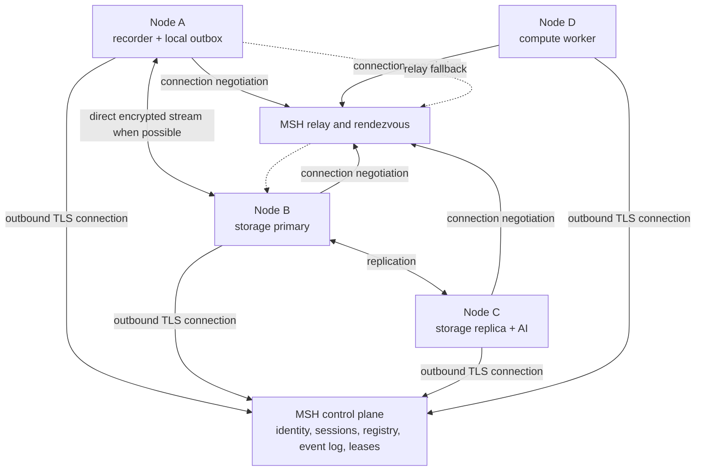

# Federated MSH Session Network

Status: architectural proposal; not implemented.

This document proposes a federated MSH network in which independently operated devices can join the same logical session over different physical networks and contribute one or more capabilities. A node may provide storage, recording, language-model inference, computation, object storage, analysis, or user-interface access. Multiple providers of the same capability may participate at the same time.

The proposal extends the existing connected-language-model pattern into a general node, session, and capability architecture. It is deliberately separate from the current single-process orchestrator and file-based workflow implementation.

## Goals

The architecture should allow MSH to:

- connect nodes that are behind different routers, NAT gateways, firewalls, and dynamic public addresses;
- give all authorized nodes a shared, versioned understanding of one session;
- support multiple providers of each capability type;
- let nodes contribute more than one capability;
- continue useful local work while disconnected;
- replicate session data across multiple independently operated storage nodes;
- select a single writable storage leader without split-brain;
- promote the most complete qualified storage replica when leadership must change;
- keep databases and local service ports private rather than exposing them directly to the internet;
- preserve MSH's loss-aware recorder behavior and idempotent recovery semantics;
- evolve incrementally from the existing repository rather than replacing all current workflows at once.

## Non-goals for the first implementation

The first implementation should not attempt to provide:

- a fully decentralized consensus system with no stable coordination service;
- a multi-primary database cluster across intermittently connected laptops;
- transparent distributed SQL across heterogeneous databases;
- automatic execution of untrusted code contributed by arbitrary nodes;
- public anonymous participation;
- Byzantine-fault tolerance against malicious session members;
- guaranteed availability when no coordinator quorum and no valid leader lease exist.

These are materially harder problems and would obscure the immediate research and engineering value.

## Terminology

- **Node**: one MSH installation with a persistent cryptographic identity.
- **Capability**: a service a node contributes, such as `storage`, `recorder`, `language-model`, or `compute-worker`.
- **Session**: a versioned logical collaboration context shared by participating nodes.
- **Control plane**: identity, session membership, capability discovery, authorization, leadership, and small coordination metadata.
- **Data plane**: telemetry, documents, objects, model requests, analysis jobs, and replication traffic.
- **Coordinator**: the authority that serializes session-control changes and grants capability leadership leases.
- **Storage leader**: the only storage provider authorized to accept new writes for a storage group in a given term.
- **Storage replica**: a storage provider that follows committed data and may later be promoted.
- **Authoritative manifest**: the committed record of datasets, batches, revisions, hashes, and capability assignments for a session.
- **Term**: a monotonically increasing leadership generation.
- **Lease**: time-limited permission to act as leader.
- **Fencing token**: a monotonically increasing token used to reject writes from an obsolete leader.

The terms `primary` and `replica` should be used in code and documentation instead of `master` and `slave`.

## High-level architecture



Every node initiates an outbound authenticated connection. No node must have a fixed public address or an inbound port forwarded through its router. The control plane establishes the shared session view. Data-plane traffic should move directly between nodes when possible and through a relay when direct connectivity cannot be established.

## Node architecture

Every participating installation should run an MSH node agent alongside the existing MSH services.

```text
MSH node
├── node agent
│   ├── persistent identity
│   ├── control-plane connection
│   ├── peer connection manager
│   ├── session synchronizer
│   ├── capability registry client
│   ├── heartbeat and health reporting
│   └── local outbox
├── zero or more capability providers
│   ├── recorder provider
│   ├── storage provider
│   ├── language-model provider
│   └── compute provider
└── existing MSH application components
```

The node agent should be a separate process or container. It exposes a local authenticated API to Flask, the recorder, storage providers, and future workers. This keeps NAT traversal, reconnect behavior, node identity, and session synchronization out of the Flask request process.

A Go-based agent using libp2p is a reasonable target architecture because it can provide encrypted peer identities, connection multiplexing, NAT reachability detection, hole punching, and circuit-relay fallback. The first milestone can use a simpler permanent WebSocket connection and relay all traffic through the central service. The application-level protocols defined below should remain independent of the transport so the transport can later be replaced.

## Node identity and enrollment

A node creates a persistent asymmetric key pair at first start. The private key must never leave the node. A stable `node_id` is derived from or bound to the public key.

A user joins a session using a short-lived invitation or device code:

```text
1. The user creates or opens a session.
2. MSH produces a short-lived join code.
3. A new node presents the code to the control plane.
4. The user or session policy approves the node.
5. The control plane binds the public key to the session membership.
6. The node receives short-lived credentials and the current session revision.
7. The node announces its capabilities.
```

A join code is not a permanent secret. Normal operation should use mutually authenticated TLS, signed challenges, or short-lived tokens bound to the node identity.

Each capability should receive the minimum required authorization scope. For example, a recorder may receive `storage:telemetry:write` but no document-read or session-administration permission.

## Session model

A session is an explicit distributed object, not only a local directory under `results/workflows/`.

A session should have at least:

```json
{
  "schema": "msh.session.v1",
  "session_id": "session-cnc-2026-07-28",
  "workspace_id": "workspace-msh-research",
  "name": "Mazak tool-wear experiment",
  "revision": 219,
  "state": "active",
  "created_at": "2026-07-28T10:00:00Z",
  "created_by": "node-recorder-a",
  "participants": [
    "node-recorder-a",
    "node-storage-a",
    "node-storage-b",
    "node-ai-a"
  ],
  "capability_groups": {
    "storage-main": {
      "leader": "node-storage-a",
      "term": 14,
      "fencing_token": 9814,
      "replicas": ["node-storage-b"]
    },
    "language-model": {
      "selection_policy": "best-available",
      "providers": ["node-ai-a"]
    }
  }
}
```

The control-plane representation is small. Large telemetry, audio, images, raw XML, analysis outputs, and models belong to the data plane and remain on contributed nodes according to the session's placement policy.

## Session event log

Control-plane changes should be represented as an append-only, monotonically ordered session event log.

Examples:

```text
session.created
node.joined
node.left
capability.registered
capability.health.changed
storage.group.created
storage.leader.granted
storage.leader.revoked
dataset.created
batch.committed
replica.caught_up
artifact.created
recording.started
recording.stopped
session.closed
```

An event should include:

```json
{
  "schema": "msh.session_event.v1",
  "session_id": "session-cnc-2026-07-28",
  "revision": 219,
  "event_id": "event-01K18F...",
  "event_type": "storage.leader.granted",
  "occurred_at": "2026-07-28T16:40:00Z",
  "actor_node_id": "control-plane",
  "payload": {
    "group_id": "storage-main",
    "node_id": "node-storage-b",
    "term": 15,
    "fencing_token": 9815
  }
}
```

Each node stores `last_applied_revision`. After reconnecting, it requests all later events and deterministically reconstructs the current session view. This provides auditability and avoids distributing mutable configuration files as the source of truth.

## Capability registry

The existing connected-language-model concept should become a general capability registry.

A capability announcement may look like:

```json
{
  "schema": "msh.capability.v1",
  "node_id": "node-storage-b",
  "capability_id": "storage-b-main",
  "type": "storage",
  "protocol": "msh-storage-v1",
  "protocol_version": "1.0",
  "status": "ready",
  "properties": {
    "backend": "postgresql",
    "available_bytes": 450000000000,
    "supports_replication": true,
    "supports_objects": true
  }
}
```

Multiple capabilities of the same type can be active. Selection policy depends on the capability:

| Capability | Recommended coordination model |
| --- | --- |
| Storage | one leader per storage group, zero or more replicas |
| Session metadata | one coordinator authority, replicated event log |
| Language model | multiple active providers selected by scheduler |
| Compute | multiple workers, one owner per job |
| Recorder | multiple active recorders, exclusive ownership per source where needed |
| Object storage | placement and replication per object or dataset |
| Web UI | multiple clients, no leader |

## Connectivity across different networks

Nodes should use a two-stage connectivity model.

### Stage 1: reliable relay-first implementation

All nodes maintain an outbound TLS WebSocket or HTTP/2 connection to an internet-reachable MSH relay. The relay routes framed, authenticated streams between node IDs. This is easier to implement and test and immediately works behind most NAT and firewall configurations.

The relay must not terminate end-to-end application encryption for sensitive data. A node-to-node stream should use session-bound encryption even when transported through the relay.

### Stage 2: direct peer connections with relay fallback

The node agents exchange connection candidates through the rendezvous service and attempt direct encrypted peer connections. If direct communication fails, they use the relay connection already established by both nodes.

Clients address a logical capability rather than a physical address:

```text
/session/<session-id>/capabilities/storage-main
```

The local node agent resolves this to the current provider and chooses a direct or relayed transport. Client components should never persist a leader's changing IP address.

## Storage architecture

Storage is a capability exposed through an MSH Storage API. Other components must not connect directly to PostgreSQL, SQLite, or filesystem internals.

```text
recorder / Flask / analysis
          |
          v
local node-agent client
          |
          v
logical session storage endpoint
          |
          v
active storage leader
          |
          +--> local storage provider
          +--> replication outbox
                    ├── replica B
                    └── replica C
```

Each node may use an appropriate local backend behind the same contract:

- PostgreSQL for a stable full storage node;
- SQLite for a small node, local cache, metadata, or durable outbox;
- filesystem or S3-compatible object storage for large immutable objects;
- future providers without changing recorder or Flask logic.

A random collection of laptops should not be configured as a single multi-primary PostgreSQL cluster. MSH should replicate immutable or idempotent application-level batches between independently operated storage providers.

## Authoritative storage manifest

The phrase "most complete database" must be defined by committed coverage, not row count.

The session maintains an authoritative storage manifest containing:

- dataset IDs and schema versions;
- committed batch IDs and idempotency keys;
- contiguous source watermarks;
- explicit missing ranges;
- object hashes and sizes;
- manifest revision and hash;
- required datasets for leader eligibility;
- replica acknowledgement state.

Example:

```json
{
  "schema": "msh.storage_manifest.v1",
  "session_id": "session-cnc-2026-07-28",
  "revision": 1842,
  "datasets": {
    "mazak-telemetry": {
      "last_contiguous_sequence": 15000,
      "missing_ranges": [],
      "manifest_hash": "sha256:..."
    },
    "microphone-audio": {
      "last_committed_chunk": 431,
      "missing_ranges": [],
      "manifest_hash": "sha256:..."
    },
    "operator-knowledge": {
      "last_revision": 83,
      "manifest_hash": "sha256:..."
    }
  }
}
```

A node is leader-eligible only when it has a complete and integrity-verified copy of every dataset required by that storage group, or when an explicit degraded-mode policy permits otherwise.

Local uncommitted batches do not make a node more authoritative. They must first be validated, deduplicated, committed to the session manifest, and replicated according to policy.

## Storage leader selection

The preferred leader is the most complete **qualified** storage node. Leadership should nevertheless be sticky: a healthy current leader is retained while it remains fully caught up and eligible. This avoids unnecessary leader flapping.

Leadership changes only when:

- the current leader's lease expires;
- the leader fails health or integrity checks;
- the leader falls behind the authoritative committed manifest;
- the leader is intentionally drained for maintenance;
- a session administrator requests a controlled handover.

Candidate ordering should be deterministic:

1. eligibility and integrity verification;
2. highest authoritative session/storage revision;
3. full coverage of required datasets;
4. highest contiguous committed watermarks;
5. fewest missing committed batches or objects;
6. lowest replication lag;
7. operational stability and available capacity;
8. stable node ID as a final tie-breaker.

A node must never promote itself merely because it cannot contact the old leader. The coordinator grants leadership.

## Preventing split-brain

Every leader grant contains:

- a new `term`;
- a time-limited lease;
- a monotonically increasing fencing token.

All write and replication requests carry the term and fencing token. Storage providers reject obsolete tokens. Once term 15 is granted, a delayed term-14 leader cannot successfully commit new data even if it later reconnects.

A leader should renew its lease through the coordinator. If the control plane is temporarily unavailable, the safest default is to continue local buffering but stop globally committed writes when the lease can no longer be proven. A configurable research-mode policy may allow a known leader to continue accepting provisional local batches, but those batches must remain explicitly uncommitted until coordination returns.

The first production-quality implementation should use a stable control-plane authority or an established consensus-backed metadata store. It should not implement a new consensus algorithm inside Flask.

## Failover procedure

```text
1. Heartbeats or lease renewals from the leader stop.
2. The lease expires; old fencing tokens become invalid.
3. The coordinator requests storage-state reports from available replicas.
4. Incomplete replicas synchronize missing committed batches where possible.
5. The most complete qualified replica is selected deterministically.
6. The coordinator increments the term and fencing token.
7. The selected replica becomes leader and opens its write endpoint.
8. Session routing changes to the new logical leader.
9. The former leader rejoins only as a replica and catches up before eligibility returns.
```

If no available node contains all required committed data, the session should enter `storage-degraded` rather than silently selecting an incomplete leader. The UI must show missing datasets or ranges and require synchronization or an explicit, audited degraded-mode decision.

## Write and replication policy

Writes are submitted as immutable, idempotent batches:

```json
{
  "schema": "msh.storage_batch.v1",
  "session_id": "session-cnc-2026-07-28",
  "dataset_id": "mazak-telemetry",
  "batch_id": "batch-01K18F...",
  "source_node_id": "node-recorder-a",
  "idempotency_key": "recorder-a:agent-42:10000-10999",
  "content_hash": "sha256:...",
  "record_count": 1000
}
```

The session defines an acknowledgement policy, for example:

```json
{
  "replication_factor": 3,
  "write_acknowledgement": 2,
  "minimum_available_replicas": 1,
  "automatic_failover": true
}
```

Possible policies are:

- leader acknowledgement: low latency, greater failover loss risk;
- leader plus one replica: recommended default for important experiments;
- quorum acknowledgement: stronger durability but lower availability on intermittently connected nodes.

The recorder retains its local batch until the required acknowledgements are received. Repeated delivery is safe because the batch ID, idempotency key, and content hash make ingestion deterministic.

## Offline-first behavior

Every state-changing local component should use a durable outbox.

```text
produce local event or batch
        |
        v
write atomically to local durable storage
        |
        v
append outbox entry
        |
        v
attempt delivery and retry with backoff
        |
        v
verify acknowledgement and manifest revision
        |
        v
mark outbox entry complete
```

During a network outage:

- recording continues locally;
- existing local analyses may continue;
- pending batches remain in the outbox;
- no node self-promotes to storage leader;
- session-control changes remain pending;
- reconnect requests events after `last_applied_revision` and resumes batch delivery.

This should preserve the current recorder principle that raw material and normalized representations are stored before the durable checkpoint advances.

## Data placement and heterogeneous storage

One session may contain several storage groups rather than requiring every database to contain every byte.

```text
session
├── telemetry storage group
│   ├── primary A
│   └── replica B
├── audio/object storage group
│   ├── primary B
│   └── replica C
└── session catalog
    └── authoritative manifest of placement and hashes
```

This avoids ambiguous comparisons where one node has more telemetry but another has more audio. Leadership and completeness are evaluated per storage group. The session catalog provides the unified logical view.

A small node may contribute only cache capacity or selected datasets. Capability metadata must clearly distinguish:

- authoritative leader;
- full replica;
- partial replica;
- cache;
- archive;
- object-only provider;
- durable recorder spool.

## Application-level protocols

The transport should carry versioned MSH protocols such as:

```text
/msh/control/1.0
/msh/session/1.0
/msh/capabilities/1.0
/msh/storage/1.0
/msh/replication/1.0
/msh/jobs/1.0
```

Large transfers require:

- streaming and bounded memory usage;
- chunk hashes;
- optional compression;
- resumable transfer cursors;
- explicit commit acknowledgement;
- cancellation and timeout propagation;
- request IDs and structured errors;
- protocol-version negotiation.

The protocol schema should be independent of Python object serialization. JSON is acceptable for control messages; NDJSON, compressed frames, or Parquet may be used for large telemetry transfers. Large binary objects should use chunked object transfer rather than embedding bytes in JSON.

## Security model

Minimum requirements:

- persistent node identity based on asymmetric keys;
- encrypted and mutually authenticated control-plane connections;
- end-to-end encrypted peer streams, including relay traffic;
- short-lived session-bound authorization tokens;
- capability-specific scopes;
- revocable node membership;
- signed or coordinator-authorized leadership grants;
- validation of session ID, term, fencing token, schema, size, and content hash on every write;
- rate and storage quotas;
- audit events for membership, authorization, leadership, degraded mode, and data deletion;
- no direct public PostgreSQL, Ollama, or Flask service ports by default.

A capability provider is not trusted merely because it is connected. Session policies determine which nodes may read particular datasets, execute jobs, or become leader-eligible.

## Relationship to current MSH

The current repository is Flask-first, file-based, and uses JSONL as the raw source of truth with DuckDB/Parquet as a disposable analytical cache. The current orchestrator is single-process and should remain responsible for local workflow execution during early migration.

The federated design should be introduced behind interfaces:

```text
catalog/
  node/
    identity.py
    agent_client.py
    heartbeat.py

  capabilities/
    models.py
    registry.py
    selection.py

  sessions/
    models.py
    event_log.py
    manifest.py
    synchronization.py

  storage/
    contracts.py
    client.py
    outbox.py
    replication.py
    providers/
      filesystem.py
      sqlite.py
      postgres.py
      remote.py
```

The existing recorder file store becomes the first local filesystem provider. Existing Flask and analysis paths continue to work while selected read paths are moved behind storage interfaces.

## Recommended implementation phases

### Phase 0: contracts and failure model

- Define node, session, event, capability, batch, manifest, lease, term, and fencing-token schemas.
- Write invariants and failure scenarios before network code.
- Define which operations are strongly coordinated and which are eventually consistent.

Exit criterion: schema tests and deterministic leader-selection tests pass without networking.

### Phase 1: local abstractions

- Introduce storage and capability interfaces.
- Wrap the current filesystem recorder storage behind those interfaces.
- Add durable SQLite outbox support.
- Preserve existing behavior and tests.

Exit criterion: current local workflows run unchanged through the new interfaces.

### Phase 2: relay-first node network

- Deploy a minimal control plane with node enrollment, sessions, capability registry, ordered session events, and heartbeats.
- Add a permanent outbound WebSocket from each node.
- Route framed node-to-node messages through the relay.
- Add session join and connection status to the UI.

Exit criterion: nodes on unrelated networks join one session and exchange authenticated test messages without port forwarding.

### Phase 3: storage API and multiple providers

- Add PostgreSQL and filesystem storage providers behind `msh-storage-v1`.
- Register multiple storage capabilities.
- Implement leader/replica assignments, terms, leases, and fencing.
- Implement batch replication and acknowledgement policy.

Exit criterion: two storage nodes on different networks replicate an idempotent recorder batch and survive a controlled leader handover.

### Phase 4: completeness-aware failover

- Implement authoritative storage manifests and per-dataset watermarks.
- Verify hashes and missing ranges.
- Promote only complete qualified replicas.
- Add explicit degraded mode when no complete candidate exists.

Exit criterion: automated failure tests demonstrate that an incomplete replica is never silently promoted.

### Phase 5: direct peer transport

- Introduce the dedicated node agent and direct encrypted peer streams.
- Retain relay fallback.
- Add resumable large-object transfer.

Exit criterion: data normally flows directly when possible and transparently falls back to relay across restrictive networks.

### Phase 6: distributed workers and additional capabilities

- Generalize scheduling for multiple language-model and compute providers.
- Add job ownership, cancellation, resource reporting, and artifact placement.
- Keep capability-specific coordination policies rather than forcing primary/replica semantics onto every provider type.

## Required tests

The architecture should not be considered safe without automated tests for:

- two nodes attempting first leadership simultaneously;
- control-plane partition while the old leader remains reachable to some peers;
- stale leader reconnecting with an old fencing token;
- more rows but lower authoritative revision;
- complementary partial datasets on different replicas;
- corrupt batch or object hash;
- duplicate batch delivery;
- interrupted replication and resume;
- leader failure before and after replica acknowledgement;
- all replicas offline;
- node clock skew;
- revoked node continuing to send traffic;
- protocol-version mismatch;
- coordinator restart and event-log replay;
- relay failure while a direct connection exists;
- direct connection failure with relay fallback;
- recorder operation while fully offline and later reconciliation.

## Architectural decisions

The following decisions are recommended:

1. Use a small internet-reachable control plane for the first implementation.
2. Keep raw research data on contributed nodes unless session policy explicitly places it centrally.
3. Make all nodes initiate outbound connections.
4. Start with relay-first networking, then add direct peer transport.
5. Address logical session capabilities rather than physical IP addresses.
6. Use one writable storage leader per storage group.
7. Promote the most complete qualified replica only when leadership must change.
8. Retain a healthy, complete current leader to avoid flapping.
9. Use terms, leases, and fencing tokens to prevent split-brain.
10. Replicate idempotent application-level batches rather than building a multi-primary PostgreSQL cluster from intermittent nodes.
11. Use per-storage-group completeness rather than requiring one node to store every data category.
12. Preserve local-first recording and durable outboxes.
13. Treat the current filesystem implementation as a provider during migration, not as obsolete data to discard immediately.

## Open questions

Before implementation, the project must decide:

- whether a session represents a bounded experiment, a long-lived project, or supports both through different lifecycle policies;
- which session metadata must remain available if the central control plane is offline;
- whether provisional writes may continue after a leader lease cannot be renewed;
- default replication and acknowledgement policy for research experiments;
- data residency and workspace policy for external collaborators;
- retention and deletion semantics across replicas and offline nodes;
- whether all storage replicas must use the same schema/backend or only the same MSH protocol;
- maximum relay data volume before direct transport becomes mandatory;
- how session ownership transfers when the creator is unavailable;
- what evidence is required before a storage node is considered integrity-verified and leader-eligible.

These questions should be resolved as explicit architecture decision records rather than hidden in implementation defaults.
