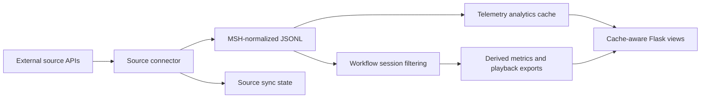

# Source synchronization

MSH originally treated `data/**/*.jsonl` as one local telemetry corpus. Observer Phoenix changes that assumption: telemetry can now arrive from several external systems, with their own identifiers, clock behavior, polling windows, and API limits.

This document defines the source-synchronization layer that sits before workflow sessions and before the Parquet/DuckDB analytics cache.

## Goals

- Keep raw telemetry ingestion source-specific at the boundary.
- Convert each source into the existing MSH JSONL contract before shared analysis code sees it.
- Track a separate synchronization watermark per source.
- Keep vendor API metadata out of recursive JSONL telemetry scans.
- Make repeated synchronization runs idempotent where possible.

## Dataflow



The key boundary is `MSH-normalized JSONL`. Anything under `data/` with a `.jsonl` suffix must be safe for the existing recursive telemetry scanner. Connector metadata, raw API pages, and watermarks should be JSON or another non-JSONL format.

## Directory convention

```text
data/
  sources/
    <source-name>/
      jsonl/
        <YYYY-MM-DD>.jsonl
  source_state/
    <source-name>.json
```

For Observer Phoenix this becomes:

```text
data/sources/observer_phoenix/jsonl/2026-07-05.jsonl
data/source_state/observer_phoenix.json
```

## Canonical source fields

Source connectors should emit the normal MSH fields where possible and add source-specific detail as extra columns. Consumers should tolerate extra fields.

Required or strongly recommended fields:

| Field | Purpose |
| --- | --- |
| `timestamp` | UTC measurement timestamp, parseable as ISO 8601. |
| `machine_id` | Stable machine identifier after source mapping. |
| `source` | Source system name, for example `observer_phoenix`. |
| `source_record_id` | Stable record key used for idempotent append/deduplication. |
| `measurement_type` | Source measurement family, for example `trend`. |
| `value` | Scalar value when the record represents one scalar signal. |
| `unit` | Measurement unit when known. |

Useful optional fields:

| Field | Purpose |
| --- | --- |
| `machine` | Human-readable machine name. |
| `source_machine_path` | Source hierarchy/path for traceability. |
| `point_id` | Measurement point ID in the source system. |
| `point_name` | Measurement point name in the source system. |
| `channel` | Source channel/direction. |
| `channel_name` | Human-readable source channel name. |
| `alarm_info` | Source alarm payload when explicitly requested. |

## Synchronization policy

Each connector should follow the same conservative pattern:

1. Read the source-specific state file.
2. Determine the synchronization window from explicit CLI parameters or the saved watermark.
3. Apply a small overlap to the previous watermark to tolerate late-arriving data.
4. Fetch source data in bounded windows.
5. Normalize records into the MSH JSONL contract.
6. Append only records with unseen `source_record_id` values to the daily JSONL file.
7. Update the source watermark only after successful writes.
8. Rebuild the telemetry analytics cache when the new source data should be visible through cache-aware paths.

This is not a live streaming architecture. It is a repeatable synchronization step that preserves the repository's current JSONL-first and cache-derived design.

## Rethinking the pipeline

The practical change is that `data/` should no longer be treated as a single undifferentiated dump folder. It should be treated as a normalized landing zone containing multiple source partitions.

The current architecture remains valid if we introduce one extra layer before cache rebuild and workflow filtering:

```text
source connector -> normalized JSONL landing zone -> cache/session pipeline
```

Later improvements can build on this without breaking the contract:

- source mapping tables for reconciling vendor machine IDs with local MSH machine aliases.
- a global deduplication index instead of per-file `source_record_id` scanning.
- incremental Parquet updates instead of full cache rebuilds.
- separate annotation streams for alarms, notes, event cases, and operator interventions.
- separate high-volume artifact stores for spectrum/TWF data rather than flattening it into scalar trend JSONL.

## Non-goals for the first implementation

- It does not commit vendor reference PDFs or proprietary data.
- It does not replace JSONL as the source-of-truth archive.
- It does not make the Parquet cache the ingestion store.
- It does not automatically reconcile clocks across systems beyond preserving UTC timestamps and source IDs.
- It does not attempt to flatten large spectrum/TWF arrays into the normal scalar trend stream.
